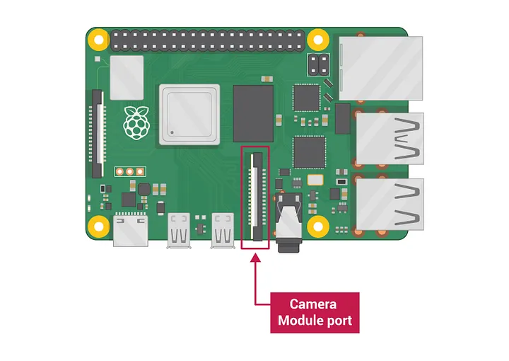
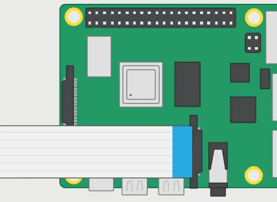
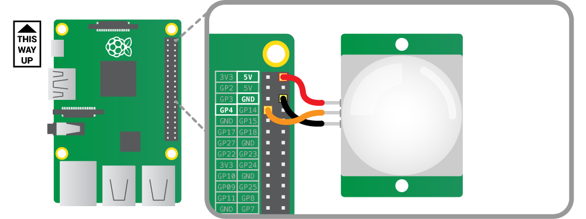
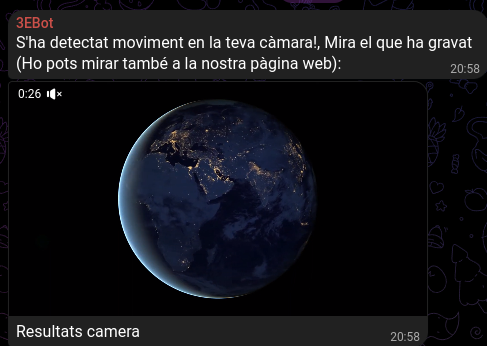
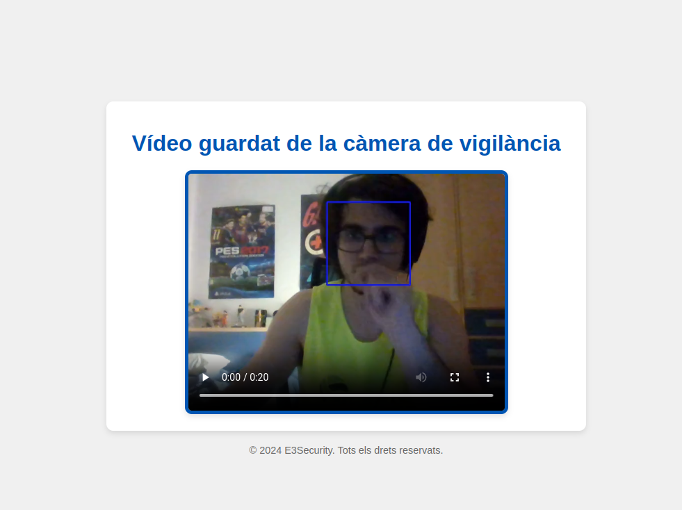
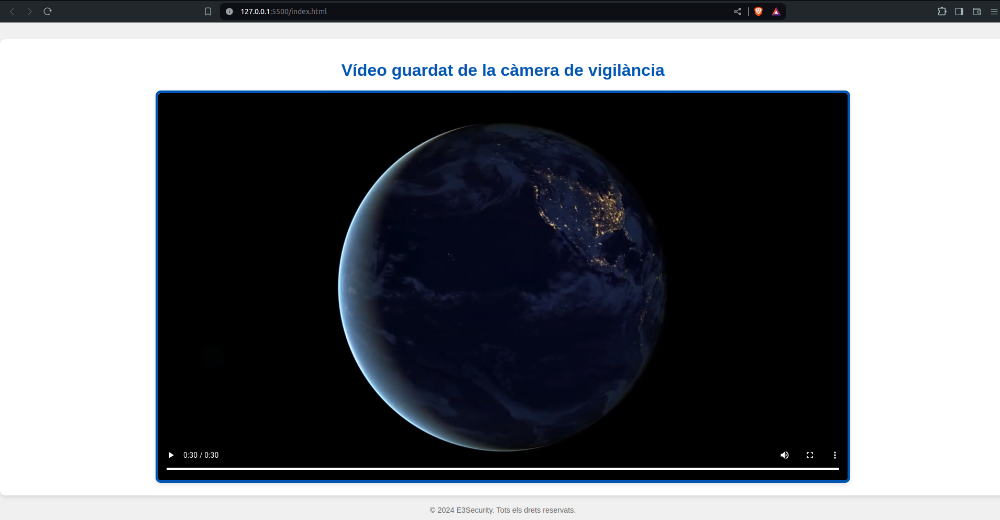

<h1 align="center">Sistema de càmera amb bot de telegram - E3 Security - ASIX 2023/2024 - EloiCortiella</h1>

<p align="center">


</p>

<p align="center">

</p>

Aquest projecte consisteix en un sistema de vigilància que detecta moviment mitjançant un sensor PIR, grava el vídeo amb una càmera, i envia notificacions amb el vídeo gravat a través d'un bot de Telegram. A més, es pot visualitzar el vídeo guardat a través d'un servidor de pàgina web.

## Requisits

- Raspberry Pi 4
- Sensor PIR
- Càmera compatible amb Raspberry Pi
- Connexió a internet (per a la hipotètica pàgina web)
- Paquets, dependències i llibreries usades:
    - **requests**: certifi chardet idna urllib3 pyOpenSSL cryptography six
    - **opencv**: numpy opencv-python-headless
    - **imageio**: imageio[ffmpeg], pillow>=8.3.2, numpy
    - **flask**: Jinja2>=3.1.2, Werkzeug>=3.0.0, blinker>=1.6.2, itsdangerous>=2.1.2, click>=8.1.3, MarkupSafe>=2.0
- Servidor de pàgina web per a visualitzar els vídeos

## Configuració del sistema

### Maquinari

1. Connecta el sensor PIR a la Raspberry Pi:
   - VCC del sensor PIR a un pin de 5V de la Raspberry Pi.
   - GND del sensor PIR a un pin GND de la Raspberry Pi.
   - Pin de senyal del sensor PIR al pin GPIO 18 de la Raspberry Pi.

2. Connecta la càmera compatible amb la Raspberry Pi al connector CSI.

## Exemple de connexió camera

Connectem la càmera al port compatible per als mòduls de càmera raspberrypi 4:

<p align="center">

</p>

Obrirem les pestanyes que soporten la càmera i introduïrem dins la zona de plàstic per la cara de les pestanyes (Molt important, ja que sino no detectarà la càmara!):

<p align="center">

</p>

### Com hauria de quedar:

<p align="center">

</p>

## Exemple de connexió sensor de moviment

<p align="center">

</p>


## Programari

### Instal·lació de dependències

Instal·la les següents dependències utilitzant pip:

```bash
pip install requests certifi chardet idna urllib3 pyOpenSSL cryptography six numpy opencv-python-headless imageio[ffmpeg] Jinja2 Werkzeug blinker itsdangerous click MarkupSafe pillow
```

## Estructura del projecte

```css
PROJECTE_RASPBERRY/
│
├── src/
│      │
│      ├── main.py
│      ├── telegrambot.py
│      ├── server.py
│      └── static/
│                │
│                └── index.html  
└── videos/
          │ 
          └──  output.mp4 (exemple de vídeo gravat)
```

## Codi Principal

### main.py


Aquest script implementa un sistema de vigilància amb una Raspberry Pi, utilitzant un sensor PIR per detectar moviment i una càmera per gravar vídeos. Quan es detecta moviment, es grava un vídeo de 20 segons amb detecció de cares, es guarda el vídeo i s'envia una notificació amb el vídeo adjunt a través de Telegram. A més, el script neteja els pins GPIO quan s'interromp l'execució.

**· Funcionalitats Principals:**
- **Detecció de moviment:** Utilitza un sensor PIR connectat al pin GPIO 18.
- **Gravació de vídeo:** Quan es detecta moviment, grava un vídeo de 20 segons amb detecció de cares.
- **Enviament de notificacions:** Envia missatges i vídeos a través de Telegram.
- **Servei Web:** Integra un servidor web (indicat però no detallat en aquest script).
- **Neteja GPIO:** Restaura la configuració dels pins GPIO en finalitzar.

```python
import RPi.GPIO as GPIO
from telegrambot import enviarMensaje, enviarDocumento
import time
import sys
import os
import cv2
import imageio
import server

sys.path.insert(0, os.path.abspath(
    os.path.join(os.path.dirname(__file__), "..")))

# Defineix el pin GPIO al qual està connectat el pin SIGNAL del sensor
PIR_PIN = 18

# Configura els pins GPIO
GPIO.setmode(GPIO.BCM)
GPIO.setup(PIR_PIN, GPIO.IN)

# Inicialitza la variable per controlar l'estat de detecció
deteccio_activa = False


def deteccio_camara():
    # Inicializar el clasificador de detección de caras
    face_cascade = cv2.CascadeClassifier(
        cv2.data.haarcascades + "haarcascade_frontalface_default.xml"
    )

    # Inicializar la captura de video desde la cámara
    cap = cv2.VideoCapture(0)

    # Verificar si la cámara se abrió correctamente
    if not cap.isOpened():
        print("Error al abrir la cámara")
        exit()

    # Capturar el tiempo de inicio
    start_time = time.time()
    frame_count = 0
    frames = []

    while True:
        # Leer un nuevo fotograma del video
        ret, frame = cap.read()

        if not ret:
            break

        # Convertir a escala de grises para el procesamiento más eficiente
        gray = cv2.cvtColor(frame, cv2.COLOR_BGR2GRAY)

        # Detectar caras en el fotograma
        faces = face_cascade.detectMultiScale(gray, 1.3, 5)

        # Dibujar rectángulos alrededor de las caras detectadas
        for x, y, w, h in faces:
            cv2.rectangle(frame, (x, y), (x + w, y + h), (255, 0, 0), 2)

        # Agregar el fotograma a la lista de fotogramas
        frames.append(cv2.cvtColor(frame, cv2.COLOR_BGR2RGB))

        # Mostrar el fotograma con las caras detectadas
        cv2.imshow("Face Detection", frame)

        # Salir del bucle si se presiona la tecla 'q' o si han pasado 20 segundos
        if cv2.waitKey(1) & 0xFF == ord("q"):
            break

        # Verificar si han pasado 20 segundos desde el inicio de la grabación
        if time.time() - start_time >= 20:
            break

    # Liberar la captura de video y cerrar la ventana
    cap.release()
    cv2.destroyAllWindows()

    # Guardar la lista de fotogramas como un archivo de video
    output_file = "output.mp4"
    imageio.mimsave(output_file, frames, fps=15)


try:
    print("Esperant moviment...")
    while True:
        if GPIO.input(PIR_PIN):
            if not deteccio_activa:
                deteccio_camara()
                print(
                    "S'ha detectat moviment! Mira el telegram per a veure el que ha gravat la càmara"
                )
                enviarMensaje(
                    "S'ha detectat moviment en la teva càmara!, Mira el que ha gravat (Ho pots mirar també a la pàgina web:"
                )
                enviarDocumento("./videos/test.mp4")
                server
                deteccio_activa = True
                time.sleep(20)
        else:
            deteccio_activa = False  # Restableix l'estat de detecció
        time.sleep(0.1)  # Espera 0.1 segons abans de tornar a comprovar
except KeyboardInterrupt:
    print("\nS'ha interromput l'execució del programa.")
finally:
    GPIO.cleanup()  # Restaura la configuració dels pins GPIO
```

### telegrambot.py

Aquest script permet enviar missatges i documents a un grup de Telegram utilitzant les API de Telegram. Inclou les següents funcionalitats:

**Funcionalitats Principals:**
- **Configuració:** Defineix el token del bot de Telegram (idBot) i l'ID del grup (idGrupo) on es volen enviar els missatges i documents.
- **Enviar Missatge:** La funció enviarMensaje(mensaje) envia un missatge de text al grup especificat.
- **Enviar Document:** La funció enviarDocumento(ruta) envia un document al grup, amb una llegenda opcional.

```python
import requests

# Col·loca aquí el token del teu bot
idBot = '6730938053:AAGjxzquj5-M1XMSDibw_JNIzCneTwk3AXc'
# Col·loca aquí el ID del grup on vols publicar
idGrupo = '-4093496817'

def enviarMensaje(mensaje):
    requests.post('https://api.telegram.org/bot' + idBot + '/sendMessage',
              data={'chat_id': idGrupo, 'text': mensaje, 'parse_mode': 'HTML'})

def enviarDocumento(ruta):
    requests.post('https://api.telegram.org/bot' + idBot + '/sendDocument',
              files={'document': (ruta, open(ruta, 'rb'))},
              data={'chat_id': idGrupo, 'caption': ' Resultats camera'})
```

### Exemple d'execució d'script

Veiem que quan executem el script principal, la funció s'executa, i s'envia un missatge avisant de que la càmara ha detectat moviment, juntament amb el vídeo que ha gravat:

<p align="center">
    
</p>

# Pàgina web

## Descripció

La pàgina web permetrà als usuaris veure els vídeos gravats pel sistema de vigilància. La pàgina es pot implementar amb un servidor web simple que llisti els arxius de vídeo disponibles i permeti la seva visualització.

## Implementació

### Index.html

```html
<!DOCTYPE html>
<html lang="ca">
<head>
    <meta charset="UTF-8">
    <meta name="viewport" content="width=device-width, initial-scale=1.0">
    <title>E3Security camera screen direct</title>
    <style>
        body {
            font-family: Arial, sans-serif;
            background-color: #f0f0f0;
            color: #333;
            display: flex;
            flex-direction: column;
            align-items: center;
            justify-content: center;
            height: 100vh;
            margin: 0;
        }
        h1 {
            color: #0056b3;
            margin-bottom: 20px;
        }
        video {
            max-width: 70%;
            border: 5px solid #0056b3;
            border-radius: 10px;
            box-shadow: 0 4px 8px rgba(0,0,0,0.1);
        }
        .container {
            background-color: #fff;
            padding: 20px;
            border-radius: 10px;
            box-shadow: 0 4px 8px rgba(0,0,0,0.1);
            text-align: center;
        }
        footer {
            margin-top: 20px;
            color: #666;
            font-size: 0.9em;
        }
    </style>
</head>
<body>
    <div class="container">
        <h1>Vídeo guardat de la càmera de vigilància</h1>
        <video id="video" controls loop>
            <source src="output.mp4" type="video/mp4">
            <source src="test.mp4" type="video/mp4">
            El teu navegador no admet la reproducció de vídeo.
        </video>
    </div>
    <footer>
        &copy; 2024 E3Security. Tots els drets reservats.
    </footer>
</body>
</html>
```

### Servidor web simple (server.py)

Aquest script de servidor web, creat amb Flask, serveix fitxers de vídeo d'un directori específic i proporciona una llista d'aquests vídeos en format JSON. Aquí hi ha una breu explicació:

**1. Configuració del Directori:** Defineix el directori on es guarden els vídeos ```(VIDEO_DIR = Videos)```.

**2. Rutes Principals:**

- **Arrel (/):** Retorna el fitxer index.html des del directori actual.
- **Vídeos Específics (/videos/<path:path>):** Serveix un fitxer de vídeo especificat pel camí dins del directori VIDEO_DIR.
- **Llista de Vídeos (/videos):** Retorna una llista en format JSON de tots els fitxers de vídeo .mp4 del directori VIDEO_DIR.
- **Execució del Servidor:** L'aplicació Flask s'executa en el host 0.0.0.0 (S'afegirà la teva ip automàticament) i el port 5000.

```python
from flask import Flask, send_from_directory, jsonify
import os

app = Flask(__name__)

# Ruta on es guarden els vídeos
VIDEO_DIR = './videos'

@app.route('/')
def index():
    return send_from_directory('.', 'index.html')

@app.route('/videos/<path:path>')
def send_video(path):
    return send_from_directory(VIDEO_DIR, path)

@app.route('/videos')
def list_videos():
    files = [f for f in os.listdir(VIDEO_DIR) if f.endswith('.mp4')]
    return jsonify(videos=files)

if __name__ == '__main__':
    app.run(host='0.0.0.0', port=5000)
```

# Resultats (En procés)

## 1. Resultat scripts de python (DEFINITIU)

<p align="center">
    <video controls loop>
        <source src="./documentacio/comprovació-script.mp4" type="video/mp4">
    </video>
</p>

## Resultats de la pàgina web al registrar un video en el seu directori

<p align="center">
    
</p>

## Resultats de la càmera detectant la cara

<p align="center">
    <video controls loop>
        <source src="./documentacio/comprovacio-index.mp4" type="video/mp4">
    </video>
</p>

## 2. Pàgina web del servidor:

Veurem el contingut del index.html sense obrir el servidor entrant a la url ```http://localhost:5500 o http://127.0.0.1:5500/index.html```

<p align="center">

</p>

# Conclusions

Aquest projecte proporciona una solució completa de vigilància que combina un sensor PIR per a la detecció de moviment, una càmera per a la gravació de vídeo, un bot de Telegram per a les notificacions i una pàgina web per a la visualització dels vídeos gravats. La implementació utilitza una Raspberry Pi com a plataforma principal i diverses llibreries de Python per a la captura i processament de vídeo, així com per a la interacció amb el bot de Telegram i la pàgina web.

Amb aquest sistema, els usuaris poden estar segurs que seran notificats immediatament quan es detecti moviment i podran veure els vídeos gravats de manera convenient a través de Telegram o d'una pàgina web.